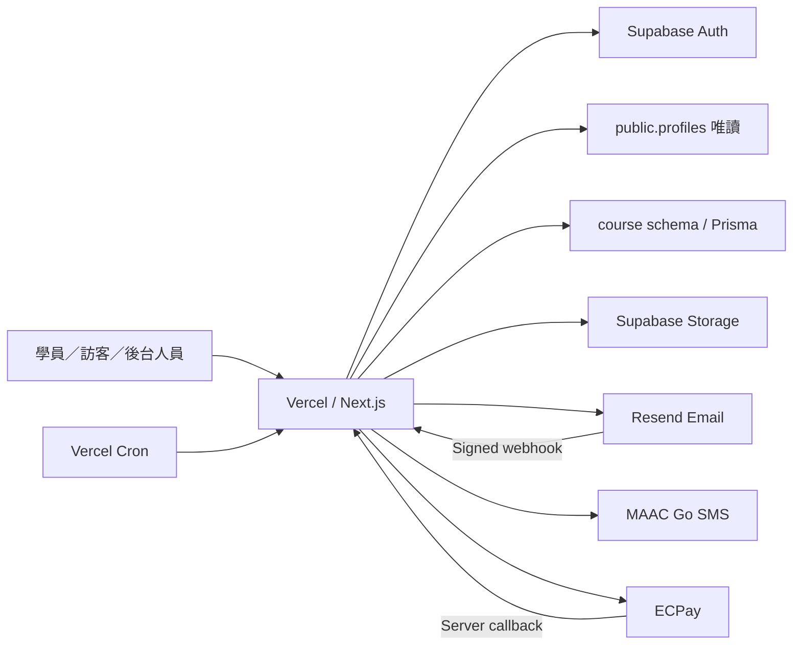
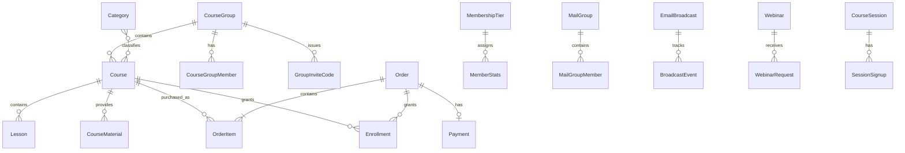
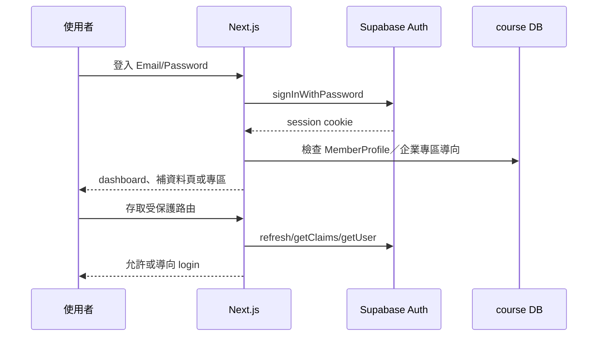
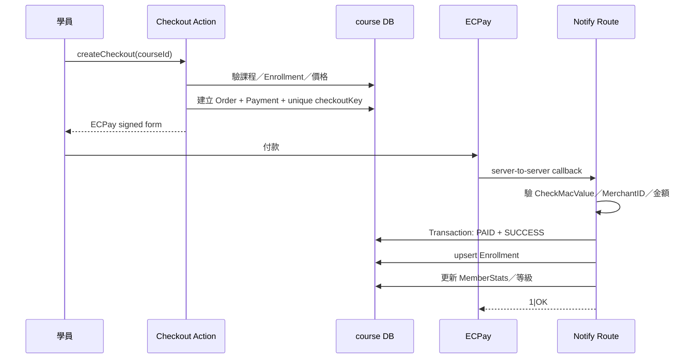
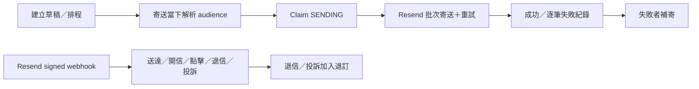

# 希望學院課程平台－系統現況架構書

> 基準日期：2026-08-08  
> 文件性質：As-Is 現況架構（以目前 `main` 程式碼與 Prisma schema 為準）  
> 正式站：<https://course.huangxi.info>  
> 目標架構與模組化搬移計畫另見 `docs/MODULARIZATION_PLAN.md`

## 1. 系統定位

希望學院課程平台是一個部署於 Vercel 的 Next.js 模組化單體應用，提供：

- 公開課程目錄、課程購買與 ECPay 金流。
- Supabase 共用會員登入、註冊、信箱確認及密碼重設。
- 課程觀看權限與會員學習入口。
- 三級後台 RBAC、會員／課程／訂單／權限管理。
- 企業專區、邀請碼與逐課授權。
- 實體／線上場次名單、1shop 訂單匯入與公開看板。
- 講座連結索取與企業包班詢問。
- Email 群發、排程、退訂、追蹤與失敗補寄。
- 簡訊名單、排程、成本防線及 MAAC Go 發送。
- 自訂頁面、站台開關、追蹤設定與媒體上傳。

目前程式仍主要依技術類型分布於 `src/app`、`src/actions`、`src/lib`；尚未實際搬入 `src/modules`。本文以業務模組重新描述現況，作為後續模組化的基線。

## 2. 技術與部署架構

| 層級 | 現行技術 | 主要責任 |
|---|---|---|
| Web | Next.js 16.2.12 App Router、React 19.2.8 | SSR/RSC、頁面、Route Handlers、Server Actions |
| 語言 | TypeScript 5 | 全端型別與業務程式 |
| UI | Tailwind CSS 4 | 前台與後台介面 |
| ORM | Prisma 6.19 | 僅管理 PostgreSQL `course` schema |
| 身分 | Supabase Auth + `@supabase/ssr` | 共用帳號、session、Email OTP／重設密碼 |
| 資料庫 | Supabase PostgreSQL | `auth`、`public`、`course` 三個 schema |
| 儲存 | Supabase Storage `course-assets` | 課程圖片、DM、講義等檔案 |
| Email | Resend | Auth SMTP、EDM、講座及企業詢問郵件 |
| SMS | MAAC Go；本機預設 Dry Run | 正式簡訊與安全測試模式 |
| 金流 | ECPay provider adapter | 建立付款表單、驗簽與付款結果處理 |
| Excel | ExcelJS；CSV 獨立解析 | 1shop 訂單名單匯入 |
| 部署 | GitHub `main` → Vercel Production | Serverless 執行、Cron、環境變數 |



## 3. Supabase 與資料所有權

同一個 Supabase 專案同時服務 `hope.huangxi.info` 與本課程平台，三個 schema 的權責不同：

```text
Supabase project
├── auth
│   └── Supabase Auth 管理；兩站共用會員帳密與 session
├── public
│   └── QBC 系統擁有；本專案只讀 profiles（姓名、email、role 等）
└── course
    └── 本專案 Prisma 獨佔；所有課程平台業務資料
```

不可違反的資料庫規則：

1. Prisma 只允許管理 `course` schema。
2. `schema.prisma` 不得宣告 `public` 或 `auth` model，不啟用 multiSchema。
3. 本專案不得 migration、drop 或寫入 QBC 的 `public` schema。
4. Supabase Auth 的管理操作只可由 server-only admin client 執行。
5. runtime 使用 transaction pooler；migration 使用 session pooler。
6. Migration 採手寫 SQL、先本機驗證，並檢查不得出現 `public.`、`auth.` 或非預期 schema drop。

## 4. 執行期分層

### 4.1 路由與呈現層

`src/app` 依使用者情境分成：

- `(shop)`：公開課程、內容頁與企業專區。
- `(auth)`：登入、註冊、忘記密碼、重設密碼、補齊個人資料。
- `(member)`：dashboard、會員資料、訂單、我的課程與學習頁。
- `(admin)`：課程、會員、訂單、權限、行銷、專區、場次及設定。
- `api`：ECPay callback、Resend webhook、退訂及排程任務。
- 公開獨立流程：看板、講座索取、企業詢問、自訂頁面。

### 4.2 Application／Action 層

`src/actions` 目前是 Server Actions 入口：

- `auth.ts`：身分與會員資料。
- `admin.ts`：課程、會員、Enrollment、Email、分類、權限及企業專區等大量後台功能。
- `checkout.ts`：購買流程。
- `sessions.ts`、`board.ts`：場次與看板。
- `sms.ts`：簡訊。
- `webinar.ts`：講座。
- `corporate.ts`：企業詢問。
- `pages.ts`：自訂頁面。
- `zone.ts`：邀請碼兌換。

`admin.ts` 是目前最大的聚合點，也是模組化時優先拆分的技術債，但拆分前必須以現有行為測試鎖定結果。

### 4.3 業務與整合層

`src/lib` 目前同時包含：

- 業務規則：課程可見性、觀看權限、會員等級、邀請與待開通。
- provider adapter：ECPay、Resend、MAAC Go、Dry Run。
- 資料與身分基礎設施：Prisma、Supabase clients。
- 內容工具：Email render、YouTube、embed、CSV、格式化。

後續模組化會將業務規則移入各模組，SDK 與基礎 client 移入 platform／infrastructure。

## 5. 業務模組總覽

| 模組 | 核心責任 | 主要資料 owner | 目前主要程式位置 |
|---|---|---|---|
| Identity | 登入、註冊、確認信、密碼、手機、個資同意 | `MemberProfile`；外部 `auth.users` | `actions/auth.ts`、`lib/member-profile.ts`、`lib/supabase` |
| Access Control | admin/operator/coach、守門、權限指派、稽核 | `StaffRole`、`AdminAuditLog` | `lib/auth`、admin staff actions |
| Course Catalog | 分類、課程、章節、教材、發布與排序 | `Category`、`Course`、`Lesson`、`CourseMaterial` | admin course actions/pages |
| Learning Access | 課程觀看、手動／批次／購買授權、待開通 | `Enrollment`、`PendingEnrollment` | `lib/course-access.ts`、admin enrollment actions |
| Commerce | 結帳、訂單、付款、ECPay callback | `Order`、`OrderItem`、`Payment` | `actions/checkout.ts`、`lib/payment`、payment routes |
| Membership | 消費統計、購課數、等級與折扣 | `MemberStats`、`MembershipTier` | `lib/membership/tier.ts` |
| Member Operations | 會員查詢、新增、匯入、重設及跨模組批次操作 | 協調模組，不新增主要 owner | admin member actions/pages |
| Zones | 企業專區、會籍、邀請碼、專區課程 | `CourseGroup`、`CourseGroupMember`、`GroupInviteCode` | `actions/zone.ts`、`lib/zone-*`、zone pages |
| Sessions & Board | 場次、報名、1shop 匯入、公開看板驗證 | `CourseSession`、`SessionSignup`、`BoardLoginThrottle` | session/board actions、`lib/board-*`、`lib/session-import.ts` |
| Webinars | 講座頁、索取連結、寄送與狀態 | `Webinar`、`WebinarRequest` | `actions/webinar.ts`、webinar pages |
| Corporate Inquiries | 企業詢問、通知、狀態及內部備註 | `CorporateInquiry` | `actions/corporate.ts`、corporate pages |
| Email Marketing | EDM、模板、名單、排程、事件、退訂與補寄 | `EmailBroadcast`、`MailTemplate`、`MailGroup*`、`MailUnsubscribe`、`BroadcastEvent` | `lib/email`、broadcast actions/pages、cron/webhook |
| SMS Marketing | 簡訊名單、內容、排程、成本防線、退訂、provider | `SmsBroadcast`、`SmsOptOut` | `actions/sms.ts`、`lib/sms`、sms pages |
| Site Content | 自訂頁面、頁面開關及 tracking 設定 | `CustomPage`、部分 `SiteSetting` keys | `actions/pages.ts`、`lib/site-pages.ts`、`lib/tracking.ts` |
| Media Storage | 圖片／文件上傳、公開 URL、embed／YouTube | 無獨立業務表 | Supabase admin storage functions、`lib/embed.ts`、`lib/youtube.ts` |
| Platform | DB/Auth client、session proxy、安全標頭與設定 | `_prisma_migrations`、平台設定 | `lib/db.ts`、`lib/supabase`、`proxy.ts`、`next.config.ts` |

`SiteSetting` 是目前跨功能 key-value 表；各 key 應由實際功能模組擁有，不應全部歸入 Site Content。例如看板登入設定屬於 Sessions & Board，簡訊成本設定屬於 SMS Marketing。

## 6. 身分、會員資料與隱私

### 6.1 Session 與帳號

- Supabase Auth 是帳密與 session 的唯一來源。
- `src/proxy.ts`／Supabase SSR proxy 負責刷新 session cookie，並擋未登入者進入會員及後台路由。
- Server Component 與 Server Action 仍必須再次取得可信 user，不以 proxy 作唯一授權依據。
- Confirm email、SMTP 及 session timeout 是 Supabase 專案層級設定，修改會同時影響 hope 站。

### 6.2 會員資料

- QBC `public.profiles`：本專案唯讀，供姓名、Email 與最高管理員角色判斷。
- `course.MemberProfile`：本平台管理手機、個資同意版本與時間等課程平台專屬資料。
- 新註冊者需填手機並同意個資條款；既有會員若缺資料，登入後導向補齊流程。

### 6.3 明碼初始密碼－已接受的產品規範

- `MemberPassword` 目前保留管理員建立／重設會員時的初始密碼，供授權後台備查。
- 這是產品負責人明確接受的風險，不列入本階段模組化阻擋項。
- 補償控制：密碼重設只限 full admin；不可由 operator/coach 執行；操作寫入 `AdminAuditLog`；密碼不可出現在 log 或稽核內容。
- 模組化時不得擴大讀取範圍、增加新的明文副本或讓密碼跨模組傳播。

## 7. 後台 RBAC

| 能力 | admin | operator | coach |
|---|---:|---:|---:|
| 進入後台／查看允許資料 | ✅ | ✅ | ✅ |
| 一般內容編輯、匯入、匯出、群發 | ✅ | ✅ | ❌ |
| 分頁／追蹤設定 | ✅ | ❌ | ❌ |
| 幹部權限管理 | ✅ | ❌ | ❌ |
| 會員密碼重設 | ✅ | ❌ | ❌ |

角色來源：

- `admin`：QBC `public.profiles.role=admin`，優先級最高。
- `operator`、`coach`：`course.StaffRole`。

防護層：

1. Proxy：只檢查是否登入。
2. Admin layout／頁面 guard：控制能否看頁面或編輯頁。
3. Server Action guard：`requireStaff`、`requireEditor`、`requireFullAdmin`，為真正授權邊界。
4. 高敏感操作：再次檢查目標帳號並寫入 `AdminAuditLog`。

UI 隱藏按鈕只改善體驗，不構成安全控制。

## 8. 核心資料關係



重要語意：

- `MailGroupMember` 是行銷收件名單，不代表課程觀看權限。
- `CourseGroupMember` 是企業專區會籍，不代表已能觀看該專區所有課程。
- `Enrollment` 是能否觀看課程的唯一業務依據。
- `Order/Payment` 記錄商業交易；付款成功後才建立／upsert `Enrollment`。
- `MemberStats` 是購買統計與會員等級，不是授權來源。

## 9. 核心流程

### 9.1 登入與受保護路由



### 9.2 購買與授權



現行完整性控制：

- `checkoutKey` 唯一值防止同一會員／課程併發建立多筆有效 PENDING。
- PENDING 兩小時後 lazy 轉 EXPIRED 並釋放防重鍵。
- `orderNo` 使用加密安全亂數且符合 ECPay 長度限制。
- callback 驗簽、金額及 MerchantID；真正授權只由 server callback 觸發。
- Enrollment 使用唯一鍵與 upsert 保持冪等。

### 9.3 Email 群發



- Vercel Cron 以 Bearer `CRON_SECRET` 驗證。
- Resend webhook 驗 Svix HMAC、timestamp 並以資料庫唯一鍵去重。
- 429／5xx／network error 有退避重試；逐筆失敗可建立補寄紀錄。
- 退訂 token 使用 HMAC 驗證。

### 9.4 簡訊

- 未設定 provider 或明確設為 `dryrun` 時不真實發送、不產生成本。
- Production 可使用 MAAC Go adapter；憑證只存在 server-side 環境變數。
- 逐位收件人渲染內容並呼叫 `/sms/send`，保留逐筆成功／失敗對應。
- provider 對 429／5xx／network error 實作退避策略。
- 單次／每日則數與價格等營運設定存於 `SiteSetting`，由 SMS 模組擁有。
- MAAC Go delivery webhook 尚未接入；目前 provider 宣告支援 receipt，但平台尚無回流流程。

### 9.5 企業專區

- 公開課程查詢集中使用可見性規則，專區課不出現在一般商店。
- 專區課不能透過竄改 courseId 進入一般 checkout。
- 邀請碼兌換建立 `CourseGroupMember`；會籍與 Enrollment 刻意分離。
- 專區會員仍需逐課 Enrollment 才能觀看。

### 9.6 場次看板

- 看板採 4 位數字即時登入碼，這是保留的產品規範。
- Session cookie 使用獨立 `BOARD_SESSION_SECRET` 的 HMAC-SHA256，含版本、到期時間與 nonce。
- Cookie 為 HttpOnly、正式環境 Secure、SameSite=Lax。
- DB `BoardLoginThrottle` 提供跨 serverless instance 的 IP 與全域失敗限流。
- Session 預設 8 小時、上限 24 小時；改碼、換 secret 或 token version 都會使舊 cookie 失效。

## 10. 外部整合與信任邊界

| 整合 | 出站／入站 | 驗證與控制 |
|---|---|---|
| Supabase Auth | 雙向 | SSR cookie；server 端 getUser/getClaims；admin key server-only |
| Supabase DB | 出站 | Prisma 僅 course；profiles 透過 server admin client 唯讀 |
| Supabase Storage | 出站 | 後台授權後簽發 upload URL；格式與大小限制 |
| ECPay | 雙向 | 出站簽章；入站 CheckMacValue、MerchantID、金額、冪等 |
| Resend API | 出站 | server-only API key、批次與退避 |
| Resend webhook | 入站 | Svix HMAC、timestamp tolerance、DB 去重 |
| MAAC Go | 出站 | Bearer API key、provider adapter、Dry Run 安全預設 |
| Vercel Cron | 入站 | `Authorization: Bearer CRON_SECRET` |
| YouTube／Google Slides／Canva | 瀏覽器嵌入 | URL 正規化、CSP frame-src 白名單 |
| GA4／Meta Pixel／GTM | 瀏覽器出站 | 僅 full admin 可設定、ID 格式驗證、CSP 來源限制 |

## 11. 安全控制現況

- Next.js 16.2.12、React 19.2.8，已避開先前確認的 SSRF／RSC DoS 受影響版本。
- `xlsx@0.18.5` 已移除，改用 ExcelJS；CSV 走獨立 parser，並有 magic bytes 與解析上限。
- 全站強制 `frame-ancestors 'none'`、`base-uri 'self'`、`object-src 'none'`。
- 啟用 HSTS、nosniff、Referrer Policy、Permissions Policy、X-Frame-Options。
- 完整 CSP 白名單目前為 Report-Only，待觀察後切 enforced。
- 公開表單使用輸入驗證、蜜罐、重複／冷卻控制；高價值端點仍應持續監控濫用。
- 後台授權在 Server Action 重驗，不依賴 UI。
- 訂單、webhook、排程與 Enrollment 均有不同層級的冪等／claim 控制。
- 明碼初始密碼與 4 位看板碼為明確保留規範；補償控制見第 6.3 與 9.6 節。

## 12. 環境與秘密管理

環境變數分組：

- Database：`DATABASE_URL`、`DATABASE_URL_UNPOOLED`。
- Supabase：公開 URL／publishable key；server-only secret key。
- Site：`NEXT_PUBLIC_BASE_URL`。
- Payment：provider、ECPay MerchantID／HashKey／HashIV／API URL。
- Email：Resend key、寄件人、Cron secret、退訂 secret、webhook secret。
- Board：獨立 `BOARD_SESSION_SECRET`，至少 32 字元。
- SMS：provider、MAAC Go API key／team；本機預設 Dry Run。

規則：

- `.env` 不進 Git；`.env.example` 只列名稱與安全範例。
- Secret 不可進 client bundle、URL、log、稽核 payload 或錯誤回應。
- Production／Preview／Development 憑證分離；本機不得因預設值誤發真實簡訊或操作正式資料。

## 13. 排程與非同步工作

目前沒有獨立 queue worker，採資料庫狀態＋Vercel Cron／Serverless request：

- Email：Cron 定期 claim 到期 broadcast；狀態支援草稿、排程、發送中、完成、失敗與取消。
- SMS：使用相近的排程與 dispatch 模式。
- Webhook：ECPay 和 Resend 直接由 Route Handler 同步驗證與寫入。
- 卡死工作以 `claimedAt`／狀態與時間窗回收。

若未來單次名單或執行時間超過 Vercel 限制，再評估 durable queue；現階段不為模組化先行引入額外分散式基礎設施。

## 14. 測試與變更安全

最低驗證：

```bash
pnpm exec tsc --noEmit
pnpm lint
pnpm build
pnpm audit
```

重要測試邊界：

- 不得對正式 Supabase 執行自動註冊、批次寫入或破壞性測試。
- Auth 測試使用固定測試 UUID／安全環境。
- 金流需測簽章、金額／MerchantID mismatch、callback 重送及並行 checkout。
- RBAC 需測 admin/operator/coach/未登入與直接呼叫 Server Action。
- Email/SMS provider 使用 mock 或 Dry Run，除非明確執行人工正式驗收。
- Migration 必須本機 deploy，人工審 SQL，再由部署流程套用。

## 15. 已知限制與近期架構工作

1. 程式尚未按業務模組落盤；`src/actions/admin.ts` 責任過多。
2. `SiteSetting` 跨多模組共用，需要建立 key ownership registry。
3. Email 與 SMS 有相似排程／audience 概念，但應共享無業務語意的基礎元件，不合併成一個巨型通知模組。
4. MAAC Go delivery webhook 尚未接入，逐筆送達狀態不完整。
5. 完整 CSP 尚處於 Report-Only，需要觀察 1–2 週後切換 enforced。
6. 會員等級前台目前由 `TIER_SYSTEM_ENABLED=false` 停用，但後台統計仍持續累計。
7. `CLAUDE.md` 與 `README.md` 的部分待辦／整合說明較舊，後續應以本文為架構基準再同步精簡。

## 16. 模組化下一步

依 `docs/MODULARIZATION_PLAN.md` 執行，推薦順序更新為：

1. 建立 16 份模組 `模組架構.md` 骨架與模組總索引。
2. 完成 Identity、Access Control、Commerce、Learning Access 四份現況文件。
3. 建立 route/action/model → module 對照表與 import 邊界規則。
4. 先整理 Platform、Access Control、Identity、Media Storage。
5. 以 Email Marketing 作第一個實際模組搬移示範，再處理 SMS Marketing。
6. 搬移 Course Catalog、Learning Access、Membership、Commerce 核心交易鏈。
7. 最後處理 Member Operations、Zones、Sessions & Board、Webinars、Corporate Inquiries、Site Content。

每次只搬一個模組，先補現況文件與 characterization tests，再改結構；不得將資安修正、資料庫語意改動與大規模搬檔混在同一個提交。

## 17. 文件優先級

遇到描述衝突時：

1. 實際程式碼與 `prisma/schema.prisma`。
2. 本文件 `docs/ARCHITECTURE.md`（現況架構）。
3. 各模組的 `docs/modules/*/模組架構.md`（建立後應比本文更細）。
4. `CLAUDE.md`（工作鐵則與快速提示）。
5. `HANDOFF.md`／`WORKLOG.md`（歷史與交接）。
6. `REFACTOR_PLAN.md`（2026-06 Auth 改造歷史設計）。

架構、資料表、權限、外部 provider 或核心流程變更時，必須在同一個變更中更新本文件或對應模組文件。
