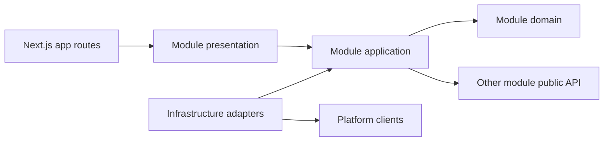

# Course Platform 功能模組化與模組架構文件計畫

建立日期：2026-08-08  
現況基準：`docs/ARCHITECTURE.md`（2026-08-08）  
狀態：規劃稿（資安前置已完成；尚未搬動現有程式）

## 1. 目標

將目前依技術類型分散在 `src/actions`、`src/lib`、`src/app` 的功能，逐步整理為以「業務能力」為邊界的模組。每個模組必須：

- 有清楚的責任、公開介面、資料所有權與權限規則。
- 主要業務邏輯集中在自己的模組中，不從其他模組深層引用內部檔案。
- 可以獨立測試、維護與替換外部服務。
- 在 `docs/modules/<module>/模組架構.md` 擁有一份與程式同步的現況文件。
- 文件描述「目前已實作的真實狀態」，未完成設計另外標示，不把願景寫成現況。

這不是微服務拆分；第一階段仍維持同一個 Next.js 應用與同一個 `course` schema，採用 modular monolith（模組化單體）。

## 2. 模組邊界原則

1. 以業務能力切分，不以 page、action、table 各自切模組。
2. 一張業務資料表只能有一個主要 owner 模組；其他模組透過公開 service/query 使用。
3. `src/app` 只負責路由、頁面組裝和 HTTP／Server Action adapter，不承載核心規則。
4. 模組不得 import 其他模組的 `internal`、repository 實作或 UI 私有元件。
5. 跨模組流程由 application service 或明確事件協調，不直接跨多個 repository 任意寫入。
6. Supabase、Prisma、Resend、ECPay、簡訊商等 SDK 只能出現在 infrastructure adapter。
7. 共用層只放真正無業務含義的工具；禁止把無法歸類的程式都丟進 `shared`。
8. 認證、授權、輸入驗證、稽核與冪等屬於所有模組共同必須遵守的橫切規則。

## 3. 目標程式結構

```text
src/
├── app/                         # Next.js routes/pages；薄 adapter
├── modules/
│   └── <module-name>/
│       ├── index.ts             # 唯一公開出口
│       ├── domain/              # 實體、值物件、純規則；不可依賴框架
│       ├── application/         # use cases、commands、queries、ports
│       ├── infrastructure/      # Prisma／Supabase／外部供應商 adapter
│       ├── presentation/        # 該功能專用 Server Actions、DTO、UI（按需）
│       └── tests/               # 單元、整合及權限測試
├── platform/                    # DB、Auth client、觀測性、設定等平台能力
└── shared/                      # 無業務語意的共用型別與純工具

docs/
└── modules/
    └── <module-name>/
        └── 模組架構.md
```

模組不必為了形式建立空資料夾；沒有 domain 邏輯的簡單模組可省略 `domain/`，但仍需 `index.ts`、測試與架構文件。

## 4. 模組清單與文件路徑

### M01 身分認證與會員資料 `identity`

- 功能：註冊、登入、登出、Email 確認、忘記／重設密碼、完成個人資料、手機更新。
- 主要現況：`src/actions/auth.ts`、`src/lib/supabase/*`、`src/lib/member-profile.ts`、auth pages。
- 資料 owner：Supabase `auth.users`；course `MemberProfile`。
- 文件：`docs/modules/identity/模組架構.md`

### M02 後台權限與稽核 `access-control`

- 功能：admin/operator/coach RBAC、頁面與 Action 守門、幹部指派、管理操作稽核。
- 主要現況：`src/lib/auth/*`、`StaffRole`、`AdminAuditLog`、staff admin pages。
- 資料 owner：`StaffRole`、`AdminAuditLog`。
- 文件：`docs/modules/access-control/模組架構.md`

### M03 課程目錄與內容管理 `course-catalog`

- 功能：分類、課程 CRUD／排序／複製／發布、章節、教材與封面素材。
- 主要現況：`src/actions/admin.ts` 的 course/category/lesson/material actions、course shop/admin pages。
- 資料 owner：`Category`、`Course`、`Lesson`、`CourseMaterial`。
- 文件：`docs/modules/course-catalog/模組架構.md`

### M04 學習與觀看權限 `learning-access`

- 功能：我的課程、課程觀看判斷、Enrollment 開通／撤銷、待開通名單、學習頁。
- 主要現況：`src/lib/course-access.ts`、`src/lib/pending-enroll.ts`、enrollment actions/pages。
- 資料 owner：`Enrollment`、`PendingEnrollment`。
- 文件：`docs/modules/learning-access/模組架構.md`

### M05 訂單與金流 `commerce`

- 功能：結帳、訂單、付款 provider、ECPay 建單與 callback、付款成功後授權。
- 主要現況：`src/actions/checkout.ts`、`src/lib/payment/*`、payment API routes、order pages。
- 資料 owner：`Order`、`OrderItem`、`Payment`。
- 跨模組：付款成功呼叫 `learning-access` 開通，呼叫 `membership` 累計消費。
- 文件：`docs/modules/commerce/模組架構.md`

### M06 會員等級 `membership`

- 功能：消費統計、購課數、等級與折扣計算、等級重算。
- 主要現況：`src/lib/membership/tier.ts`、會員後台相關查詢。
- 資料 owner：`MemberStats`、`MembershipTier`。
- 文件：`docs/modules/membership/模組架構.md`

### M07 會員營運 `member-operations`

- 功能：會員查詢、新增、批次匯入、帳號啟用／重設流程、批次開課、名單操作入口。
- 主要現況：`src/actions/admin.ts` 會員相關區段、admin member pages。
- 資料 owner：不重複擁有 identity/enrollment 資料；此模組負責跨模組營運 use case。
- 文件：`docs/modules/member-operations/模組架構.md`

### M08 企業專區 `zones`

- 功能：專區 CRUD、專區會員、邀請碼、專區課程、自動開通。
- 主要現況：`src/actions/zone.ts`、admin zone actions、`src/lib/zone-*`、zone pages。
- 資料 owner：`CourseGroup`、`CourseGroupMember`、`GroupInviteCode`。
- 文件：`docs/modules/zones/模組架構.md`

### M09 場次報名與看板 `sessions-board`

- 功能：場次、報名名單、1shop 匯入與歸類、公開看板、4 位數字驗證與限流。
- 主要現況：`src/actions/sessions.ts`、`src/actions/board.ts`、`src/lib/board-*`、`src/lib/session-import.ts`、board/session pages。
- 資料 owner：`CourseSession`、`SessionSignup`、`BoardLoginThrottle`；看板相關設定 key。
- 文件：`docs/modules/sessions-board/模組架構.md`

### M10 講座索取 `webinars`

- 功能：講座頁 CRUD、索取連結、寄送、索取名單與送達狀態。
- 主要現況：`src/actions/webinar.ts`、webinar pages、Resend webhook 的 webinar 分支。
- 資料 owner：`Webinar`、`WebinarRequest`。
- 文件：`docs/modules/webinars/模組架構.md`

### M11 企業包班詢問 `corporate-inquiries`

- 功能：公開詢問表單、通知／自動回覆、後台狀態、內部備註與通知設定。
- 主要現況：`src/actions/corporate.ts`、`src/lib/corporate.ts`、corporate pages。
- 資料 owner：`CorporateInquiry`；企業通知設定 key。
- 文件：`docs/modules/corporate-inquiries/模組架構.md`

### M12 Email 行銷 `email-marketing`

- 功能：EDM、模板、名單群組、對象解析、排程、重試、追蹤事件、退訂。
- 主要現況：`src/lib/email/*`、`src/actions/admin.ts` broadcast/group 區段、cron、unsubscribe 與 Resend webhook routes。
- 資料 owner：`EmailBroadcast`、`MailTemplate`、`MailGroup`、`MailGroupMember`、`MailUnsubscribe`、`BroadcastEvent`。
- 既有文件 `docs/edm-module.md` 需整併為新格式，完成後保留 redirect 說明或移除重複文件。
- 文件：`docs/modules/email-marketing/模組架構.md`

### M13 簡訊行銷 `sms-marketing`

- 功能：簡訊對象、內容／字數、測試寄送、排程、provider、花費防線、退訂。
- 主要現況：`src/actions/sms.ts`、`src/lib/sms/*`、admin sms pages。
- 資料 owner：`SmsBroadcast`、`SmsOptOut`；簡訊設定 key。
- 既有文件 `docs/sms-module.md` 需整併為新格式。
- 文件：`docs/modules/sms-marketing/模組架構.md`

### M14 網站內容與設定 `site-content`

- 功能：首頁／導覽頁開關、自訂頁、知識／講師／邀約頁、追蹤設定。
- 主要現況：`src/actions/pages.ts`、admin settings actions、`src/lib/site-pages.ts`、`src/lib/tracking.ts`、shop/custom pages。
- 資料 owner：`CustomPage`、一般站台 `SiteSetting` keys。
- 文件：`docs/modules/site-content/模組架構.md`

### M15 媒體與檔案 `media-storage`

- 功能：圖片簽名上傳、教材上傳、公開 URL、格式／大小限制、嵌入與 YouTube URL 處理。
- 主要現況：`src/lib/supabase/admin.ts` 的 storage functions、`src/lib/embed.ts`、`src/lib/youtube.ts`。
- 資料 owner：不擁有業務表；提供其他模組使用的 port／adapter。
- 文件：`docs/modules/media-storage/模組架構.md`

### M16 平台基礎設施 `platform`

- 功能：Prisma client、Supabase clients/session proxy、環境設定、安全標頭、共用觀測與錯誤策略。
- 主要現況：`src/lib/db.ts`、`src/lib/supabase/*`、`src/proxy.ts`、`next.config.ts`。
- 限制：這是平台能力，不得吸收任何課程、會員、訂單等業務規則。
- 文件：`docs/modules/platform/模組架構.md`

## 5. 每份 `模組架構.md` 的固定格式

每個模組文件必須使用以下章節，不能只有檔案列表：

```markdown
# <中文名稱>模組架構

## 1. 模組目的與範圍
## 2. 不屬於本模組的責任
## 3. 使用者與使用情境
## 4. 功能清單與業務規則
## 5. 權限矩陣
## 6. 架構與資料流
## 7. 公開介面（Actions／API／services／events）
## 8. 資料模型與資料所有權
## 9. 外部服務與環境變數
## 10. 跨模組依賴
## 11. 安全、隱私、冪等與限流
## 12. 錯誤處理、log、監控與告警
## 13. 測試策略與驗收案例
## 14. 部署、migration 與回滾
## 15. 檔案地圖
## 16. 已知限制與待辦
## 17. 變更紀錄
```

文件中的流程圖使用 Mermaid；至少要有一張元件／依賴圖。涉及付款、通知、邀請或批次匯入的模組，再增加 sequence diagram。資料表多於一張的模組增加 ER diagram。

## 6. 模組公開介面規範

- 外部只能由 `@/modules/<name>`（`index.ts`）匯入。
- `index.ts` 只 export 穩定的 DTO、application service、query 與必要 presentation adapter。
- Prisma model 不直接當公開 DTO；避免資料庫欄位變動擴散到 UI 和其他模組。
- Command 負責狀態改變；Query 只讀。命名例如 `createCourse`、`getCourseDetail`。
- 所有狀態改變入口都要宣告：授權需求、輸入 schema、transaction 邊界、冪等策略、稽核策略。
- 跨模組不可直接寫別人的 table。同步一致性要求高時呼叫公開 application service；可最終一致時使用明確 domain event/outbox。
- 初期不必為所有流程導入 event bus；先用型別化 service port，避免過度設計。

## 7. 依賴方向



禁止方向：domain → Next.js／Prisma／Supabase；其他模組 → infrastructure/internal；shared → 任一業務模組。

## 8. 分階段執行計畫

### Phase 0：建立基線與文件骨架

- 資安前置已於 2026-08-08 完成；明碼初始密碼及 4 位數看板碼為產品負責人明確保留規範，依 `docs/ARCHITECTURE.md` 的補償控制維持。
- 建立 16 個 `docs/modules/<name>/模組架構.md`。
- 先填寫現況，而不是先搬程式。
- 建立全域模組索引 `docs/modules/README.md`，列 owner、狀態與依賴。
- 建立目前 routes/actions/tables 對應模組的清單，確認沒有孤兒功能。

### Phase 1：切出平台與最清楚的既有模組

- `platform`
- `email-marketing`（已有架構文件）
- `sms-marketing`（已有架構文件）
- `identity`、`access-control`

先建立公開出口與測試，不急著改資料表。

### Phase 2：核心交易與學習流程

- `course-catalog`
- `learning-access`
- `commerce`
- `membership`
- `media-storage`

先為「付款成功 → 開通課程 → 更新會員等級」建立明確 application orchestration 與整合測試，再搬檔案。

### Phase 3：營運功能

- `member-operations`
- `zones`
- `sessions-board`
- `webinars`
- `corporate-inquiries`
- `site-content`

拆分目前過大的 `src/actions/admin.ts`，每次只搬一組 use case，舊 action 暫時可作 compatibility wrapper。

### Phase 4：收斂與強制邊界

- 移除 compatibility wrappers 與已無引用的舊 `src/lib` 檔案。
- 加 ESLint `no-restricted-imports` 或 dependency-cruiser 規則，阻擋跨模組深層 import。
- CI 檢查每個 `src/modules/<name>` 都有對應 `docs/modules/<name>/模組架構.md`。
- CI 檢查架構文件中的檔案地圖與公開介面未明顯失效。

## 9. 單一模組的標準搬移步驟

1. 閱讀現有程式、schema、頁面、測試與歷史文件。
2. 先寫該模組的現況 `模組架構.md`。
3. 補 characterization tests，鎖定目前可接受行為。
4. 定義 `index.ts` 公開介面與 DTO。
5. 抽出純業務規則到 domain。
6. 抽出 use cases 到 application，定義 repository/provider ports。
7. 將 Prisma／Supabase／外部 SDK 移至 infrastructure。
8. 將 route、page、Server Action 改為薄 adapter。
9. 更新所有 import，只允許經公開出口跨模組使用。
10. 執行單元、整合、權限、型別、lint、build 測試。
11. 更新 `模組架構.md` 的檔案地圖、依賴、圖表與變更紀錄。
12. 確認無引用後才刪除舊檔，單獨提交。

## 10. 完成定義（Definition of Done）

一個模組只有在以下條件全部滿足時才算完成：

- 有完整且反映現況的 `docs/modules/<name>/模組架構.md`。
- 所有主要 use case 有明確輸入、輸出、權限與錯誤契約。
- 資料 owner 與跨模組依賴已記錄。
- 業務規則不再散落在 page component 或通用 `src/lib`。
- 外部 SDK 被 adapter 隔離。
- 跨模組引用只經對方 `index.ts`。
- 有核心規則單元測試、repository/provider 整合測試、權限負向測試。
- 涉及 webhook／重試／批次／金流者有冪等與並行測試。
- `pnpm exec tsc --noEmit`、`pnpm lint`、`pnpm build` 通過。
- Migration 經人工檢查，未觸碰 Supabase `public`／`auth` schema。
- 架構文件已在同一個 PR 更新。

## 11. 風險與控制

- **大爆炸重構風險**：禁止一次搬完整專案；一個 PR 只處理一個模組或一條垂直流程。
- **循環依賴**：跨模組服務要由 use case 擁有方協調；必要時抽出明確 port，不互相深層 import。
- **資料一致性**：金流、開課、等級更新的 transaction 邊界先文件化並加測試，再拆檔。
- **Server Action 行為改變**：保留薄 wrapper 可降低 UI 一次性修改量，但要記錄移除期限。
- **文件過期**：架構文件列入 PR checklist；修改公開介面、資料表、權限、外部服務時必須同步更新。
- **shared 膨脹**：任何 shared 新增項目都要能證明無業務語意且至少被兩個模組合理共用。

## 12. 建議第一批交付

第一批先不搬程式，交付以下內容供確認：

1. 建立 16 份 `模組架構.md` 骨架。
2. 完成 `identity`、`access-control`、`commerce`、`email-marketing` 四份現況文件。
3. 建立模組索引與全系統依賴圖。
4. 建立 routes／actions／tables → module 對照表。
5. 確認模組邊界後，再由 `email-marketing` 或 `sms-marketing` 做第一個實際搬移示範。

選 `email-marketing` 作為第一個示範的理由是：現有檔案與文件已相對集中、邊界明確；但它仍包含排程、webhook、退訂與外部 provider，可驗證此模組化方法是否足以處理真實複雜度。
